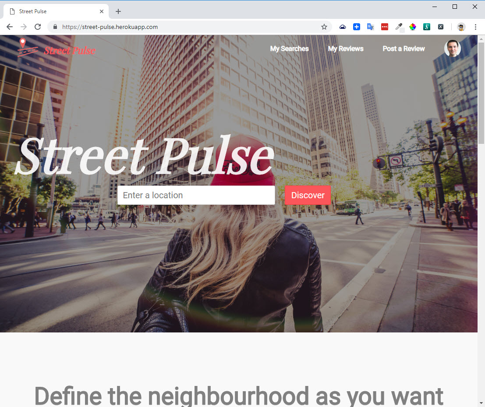

# StreetPulse | see what locals think about their neighbourhoods
### What is it for?
Looking for a new home or apartment?

Want to know more about a specific neighbourhood? Learn details and stories no real estate agent would tell you?

StreetPulse app is there to help you by providing real reviews written by people who know the street, the area, the neighbourhood.
### How to use?
Just enter address (or just a street name), set the radius (e.g. 1200m) and hit "Discover" to see the reviews from people who know the area!

### Notes
Rails app generated with some help of [lewagon/rails-templates](https://github.com/lewagon/rails-templates), created by the [Le Wagon coding bootcamp](https://www.lewagon.com) students team.

